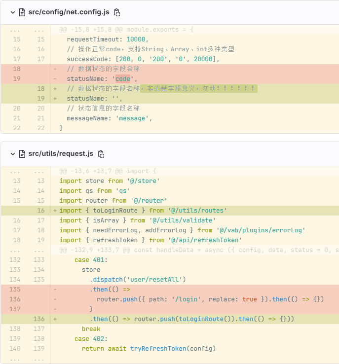
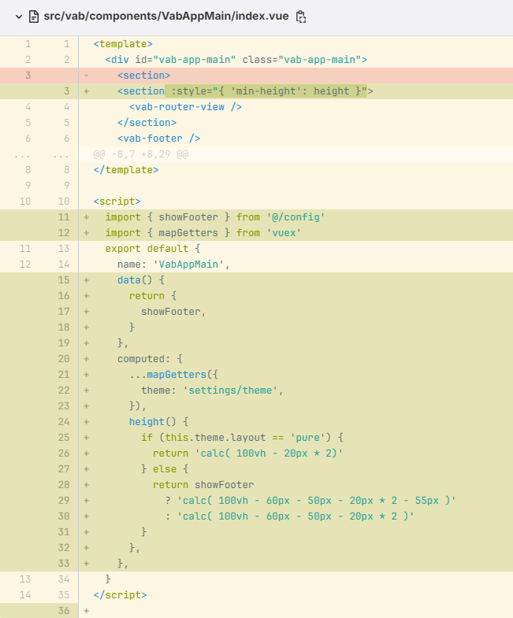
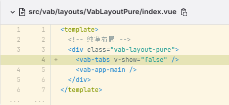
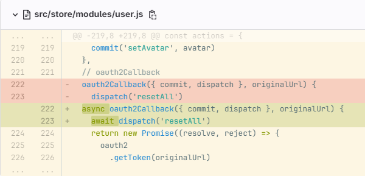
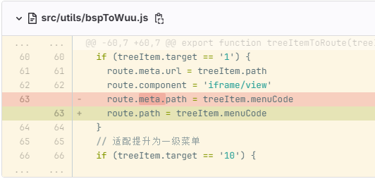
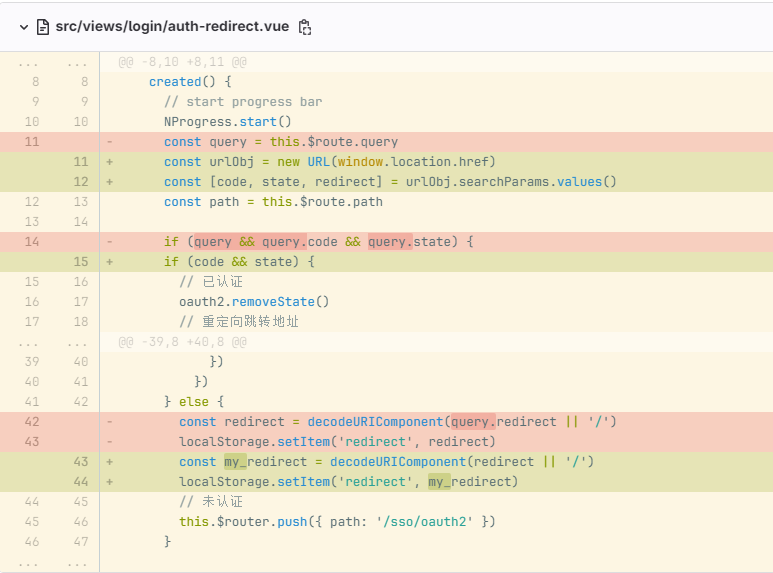
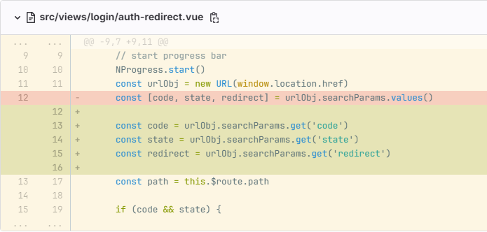
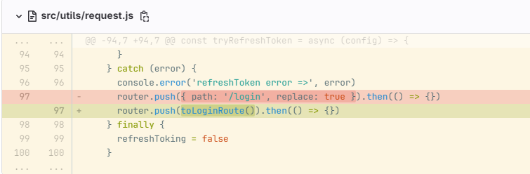
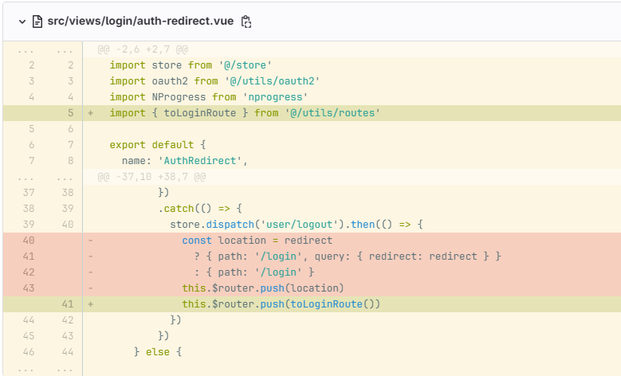

## 2023-08-11

- 修复全局退出跳转异常的问题。[修改记录](http://git.inspur.com/nrh/biz-5/frontend-public/wuu-pure/-/commit/c2fbde543244bfaeffe27669f631231e25ba730f)

## 2023-08-14

- 内容区设置最小高度，保证视图占满。[修改记录](http://git.inspur.com/nrh/biz-5/frontend-public/wuu-pure/-/commit/5bdaf27e9d639a3e1cb1662cf81ec31cca197993)

## 2023-09-20

- 纯净模式返回路由上一级保活。[修改记录](http://git.inspur.com/nrh/biz-5/frontend-public/wuu-pure/-/commit/ebb36c55a22295c3e0c17c44b59d3c589da285a0)

## 2023-09-21

- 修复线上环境浏览器存储未正确保存 token 问题。[修改记录](http://git.inspur.com/nrh/biz-5/frontend-public/wuu-pure/-/commit/06555d1a243889f71e0977e156484ab56e655703)

- 挂接页面路由显示异常问题修复。[修改记录](http://git.inspur.com/nrh/biz-5/frontend-public/wuu-pure/-/commit/69dd393d9da01e1e706fa17d07f9fe8d034a28b3)

## 2023-09-25

- 适配路由 hash 下的认证重定向。[修改记录](http://git.inspur.com/nrh/biz-5/frontend-public/wuu-pure/-/commit/af80d47e2202e498a5b44a15a169b941f0d982b7)

## 2023-10-12

- 修复 auth 跳转异常的问题。[修改记录](http://git.inspur.com/nrh/biz-5/frontend-public/wuu-pure/-/commit/76738e1425581db0971ed513246079c2459b5ab8)

## 2023-11-16

- 认证错误捕获时，登录页跳转异常问题修复。[修改记录](http://git.inspur.com/nrh/biz-5/frontend-public/wuu-pure/-/commit/229eb6f71c7dd9940f2ab3b46ceed43d197cda7b)

